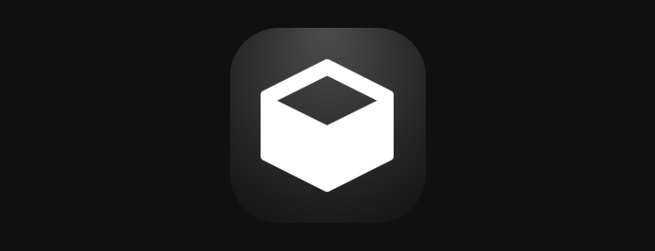
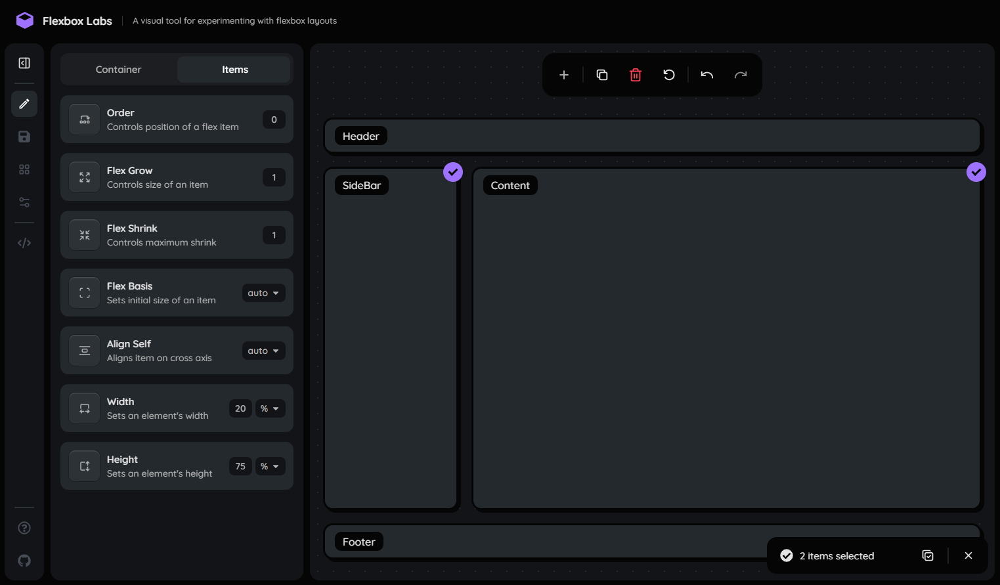

<p align="center">

</p>

<details>
  <summary>Table of Contents</summary>
  <ul>
    <li>
      <a href="#about">About</a>
      <ul>
        <li><a href="#features">Features</a></li>
        <li><a href="#built-with">Built With</a></li>
      </ul>
    </li>
    <li><a href="#usage">Usage</a></li>
    <li><a href="#live-demo">Live Demo</a></li>
    <li><a href="#getting-started">Getting Started</a></li>
    <li><a href="#contributing">Contributing</a></li>
    <li><a href="#license">License</a></li>
    <li><a href="#feedback">Feedback</a></li>
  </ul>
</details>

## About
Flexbox Labs is a visual tool that helps you create layouts using CSS Flexbox. It offers an intuitive interface that shows changes in real-time, making it easy to experiment and learn.

### Features
- **Live Preview:** Preview changes in real-time as you adjust parameters.
- **Playground Customization:** Add, delete, or duplicate flex items.
- **Undo and Redo Changes:** Easily revert or redo modifications for easy experimentation.
- **Edit Flex Properties:** Edit both flex container and individual flex item properties.
- **Save/Load Layouts**: Save, load or delete custom layouts.
- **Pre-build Layouts**: Load pre-built layouts/templates.
- **Export HTML and CSS Code:** Get HTML and CSS code for the generated layout.

### Built with

[![NextJS][nextjs-image]][nextjs-url]
[![React][react-image]][react-url]
[![TypeScript][typescript-image]][typescript-url]
[![Sass][sass-image]][sass-url]
[![Framer][framer-image]][framer-url]



## Usage
Visit the live demo and explore the playground using the toolbar. To customize the flex container, navigate to the Edit tab. Select any item from the playground to modify its individual flex properties. Once satisfied with your layout, click the code button on the tab to get the generated HTML and CSS code.

## Live Demo
Check out the live demo of Flexbox Labs: [Demo](https://flexboxlabs.netlify.app/)

## Getting Started

#### 1. Clone the repository

```shell
git clone https://github.com/your-username/flexbox-labs.git
```

#### 2. Install npm dependencies

```shell
npm install
```

#### 3. Navigate to the app directory
```shell
cd flexbox-labs
```

#### 4. Run the dev server

```shell
npm run dev
```

#### 5. Open the app in your browser

Visit [http://localhost:5173](http://localhost:5173) in your browser.

## Contributing
You are welcome to contributions to Flexbox Labs! If you'd like to contribute, please follow these steps:
1. Fork the repository.
2. Create a new branch: `git checkout -b feature/new-feature`
3. Make your changes and commit them: `git commit -m 'Add new feature'`
4. Push to the branch: `git push origin feature/new-feature`
5. Submit a pull request outlining the changes you've made.
6. Wait for me to review and merge your pull request

## License
Flexbox Labs is licensed under the [MIT License](LICENSE).

## Feedback

If you have any feedback, suggestions, or issues, please [open an issue](https://github.com/yourusername/flexbox-labs/issues).
Your input is appreciated!

## Acknowledgements

- [use-hooks](https://usehooks.com/)
- [react icons](https://usehooks.com/)

[nextjs-image]: https://img.shields.io/badge/NextJS-1a1a1a?style=for-the-badge&logo=nextdotjs
[react-image]: https://img.shields.io/badge/React-20232A?style=for-the-badge&logo=react&logoColor=61DAFB
[typescript-image]: https://shields.io/badge/TypeScript-3178C6?logo=TypeScript&logoColor=FFF&style=for-the-badge
[sass-image]: https://img.shields.io/badge/Sass-CC6699?style=for-the-badge&logo=sass&logoColor=white
[framer-image]: https://img.shields.io/badge/Framer%20Motion-1a1a1a?style=for-the-badge&logo=framer

[nextjs-url]: https://nextjs.org/
[react-url]: https://react.dev/
[typescript-url]: https://www.typescriptlang.org/
[sass-url]: https://sass-lang.com/
[framer-url]: https://www.framer.com
